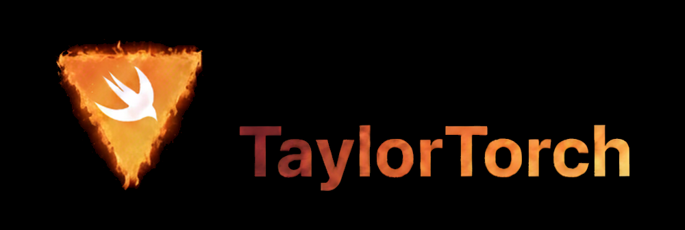

# Introduction
TaylorTorch is a modern Swift wrapper for LibTorch, designed to bring the elegance of Swift to the power of PyTorch's C++ backend. It's built from the ground up to feel idiomatic to Swift developers, fully leveraging the language's first-class automatic differentiation capabilities for seamless and efficient gradient computation. By embracing a protocol-oriented design, TaylorTorch provides a flexible and extensible "front-to-back" experience, allowing you to compose complex models with ease. The name is a fun, pop-inspired twist, reflecting our goal to combine Swift's expressive style with the legendary performance of Torch.

# Project Motivation and Vision
The journey of TaylorTorch begins with a deep appreciation for the pioneering work of the Swift for TensorFlow (S4TF) project. S4TF first introduced Differentiable Programming as a first-class feature in Swift, and although the project is now archived, its ambitious vision left a lasting impact on the community.

Fortunately, the story of automatic differentiation in Swift didn't end there. Thanks to the continued efforts of the Swift community and the dedicated team at PassiveLogic, the language's auto-diff capabilities have not only been preserved but have matured and strengthened significantly.

Witnessing these advancements, and in an era of rapid progress with technologies like Large Language Models (LLMs), I set a personal challenge: to see if the original vision of S4TF—a powerful, end-to-end deep learning framework in Swift—could be resurrected. TaylorTorch is the result of that challenge, aiming to rebuild that capability but this time powered by the robust and widely-used LibTorch backend.

This project is a foundational layer, and its future can be extended in countless ways—from adding higher-level APIs like torch.nn to developing integrations with other scientific computing libraries. The roadmap is intentionally open, as I eagerly await feedback, contributions, and ideas from the Swift community to guide its evolution.
